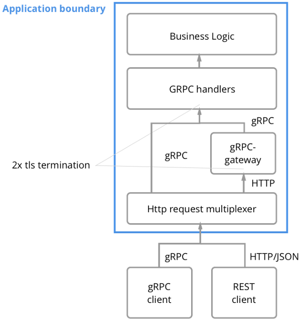
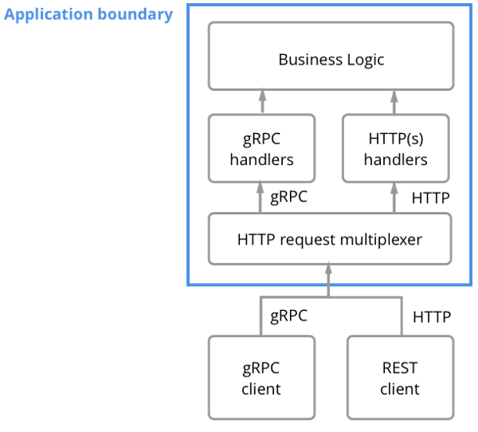

# Grpc Rest Examples
How to provide gRPC interface and HTTP 1.1 REST/JSON API
by beji
--------

## grpc-gateway
Using grpc-gateway on multiple port.

grpc-gateway is a plugin of protoc. It reads gRPC service definition, and generates a reverse-proxy server which translates a RESTful JSON API into gRPC.

## grpc-gateway_with-single-port
Using grpc-gateway on single port.

enabling applications to present both a HTTP 1.1 REST/JSON API and an efficient gRPC interface on a single TCP port.

Require TLS.
The core of the problem is that we are using a http multiplexer, and so have to use 'grpc.ServeHTTP()' instead of 'grpc.Serve()'. 
This uses go's http2 libraries under the hood, and they do require TLS.

## grpc-rest
Using cmux on single port.

There is a go library called cmux which allows mixing and filtering of different protocols on a single port, not just filtering on different routes or versions of HTTP.
